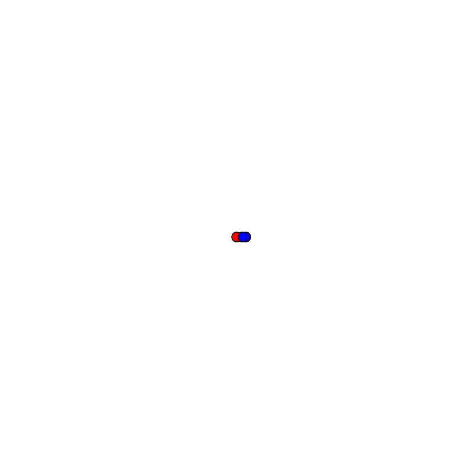

# 🧬 Signal Folding Engine Pro

A high-fidelity protein folding simulator based on signal theory, φ/ψ/ω torsions, and reactive phantom-based optimization.

> Built in Go. No neural networks. Pure signal → structure logic.

---

## 📦 Project Structure

```bash
signal_folding_pro/
├── main.go                     # Entry point
├── go.mod                     # Module config
├── datasets/
│   └── amino_acids.json       # Properties of amino acids
├── core/
│   ├── residue.go             # Residue: φ/ψ/ω, position, charge
│   ├── backbone.go            # Chain builder and total energy
│   └── properties/data.go     # JSON loader and AA props
├── signal/
│   ├── field.go               # Signal propagation
│   └── phantom.go             # Phantom reaction engine
├── optimize/
│   └── engine.go              # Iterative folding loop
├── output/
│   ├── export_pdb.go          # Save PDB for 3D viewers
│   ├── render_svg.go          # 2D visualization
│   ├── log_energy.go          # Save energy trajectory
│   └── energy_log.csv         # Result log
```

---

## ⚙️ How to Run

```bash
go run .
```

### Requirements:
- Go 1.20+
- `output/` folder must exist
- `datasets/amino_acids.json` must be valid

---

## 📈 Outputs

- `output/final_structure.pdb` — 3D structure (for PyMOL, Chimera, Jmol)
- `output/final_structure.svg` — 2D signal-coded projection
- `output/energy_log.csv` — Energy over iterations

---

## 🌌 Core Ideas

- Signal-based interactions (hydrophobic/charge fields)
- φ/ψ/ω backbone torsions and real atomic coordinates
- Phantom flares: stochastic excitations via `PhantomSystem`
- Lennard-Jones-inspired total energy

---

## 📍 Example SVG Preview



---

## 🧠 Future Directions

- ✅ Ramachandran map filtering
- 🔄 Simulated annealing mode
- 🌀 STB-phase propagation (Signal Theory of Being)
- 🧩 Real PDB import and refolding
- 🌐 Web UI + 3D GL Viewer

---

## 🧑‍💻 Author & Contact

**Muhamed Kamilovich Satybaev**  
Bishkek, Kyrgyzstan  
📧 Email: satybaevmk@gmail.com  
🔗 GitHub: [https://github.com/Mukhameds](https://github.com/Mukhameds)  
🔗 LinkedIn: [https://www.linkedin.com/in/muhamed-satybaev-38b864362](https://www.linkedin.com/in/muhamed-satybaev-38b864362)  
🔗 Telegram: [https://t.me/satybaevmk](https://t.me/satybaevmk)

---

## 📄 License

Non-commercial use only. Redistribution for academic/scientific purposes requires attribution. Commercial use is **strictly prohibited** without written permission. See [LICENSE](LICENSE) for details.
